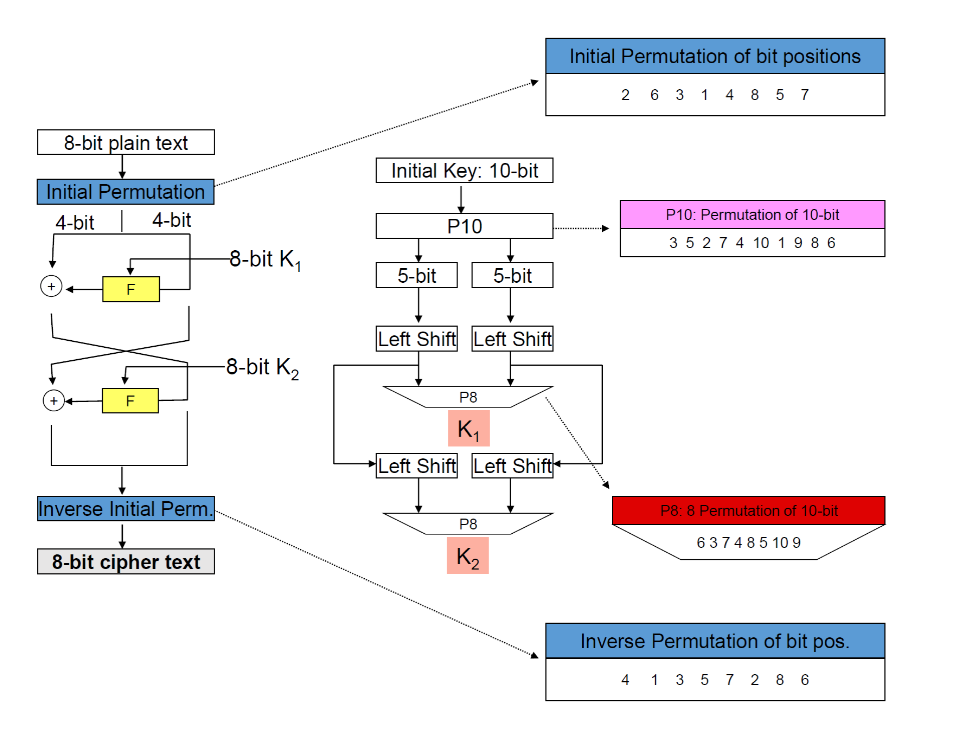
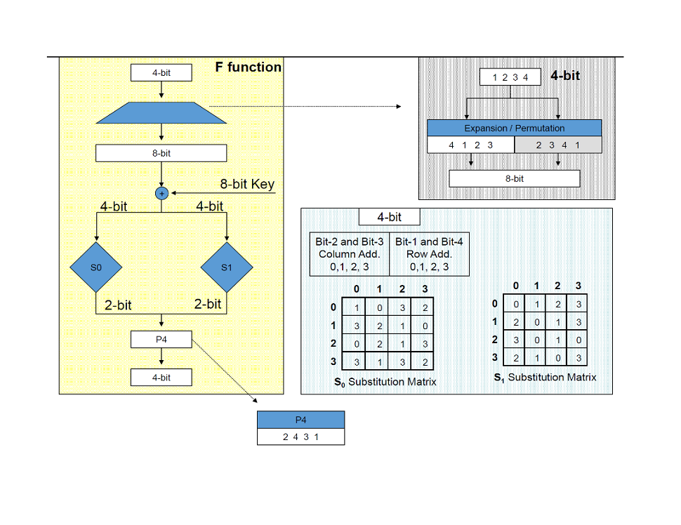
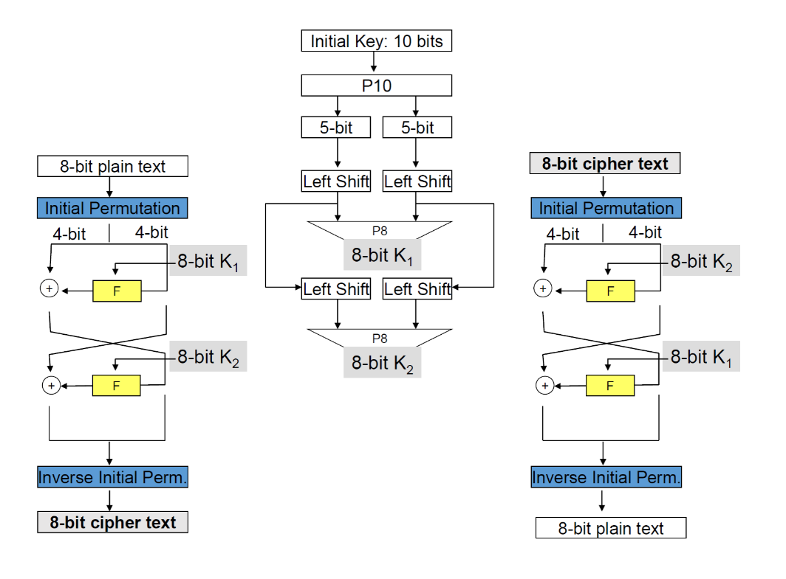
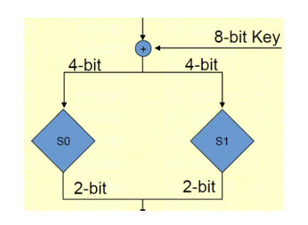

# Simplified DES cipher and S-Box attack

This project is a simplified implementation of the Data Encryption Standard cipher written in C++.  This also includes a input-output differential distribution tables for the two S-Boxes used in the simplified DES.  We can also attack these S-Boxes which gives us the possible values for the key.

## Simplified DES

* Works on 8-bit blocks and uses a 10-bit key
* Only uses two rounds
* We consider that the plaintext and cipher text are known:
  * Plaintext:  *p*1, *p*2, ... , *p*8 
  * Ciphertext: *c*1, *c*2, ... , *c*8
  * Key: *k*1, *k*2, ... , *k*10

    
    

* The encryption algorithm will produce eight non-linear equations with 10 unknowns

    

(<a href="#top">back to top</a>)

## Differential Cryptanalysis

* Builds input-output distribution tables for the S-Boxes in the simplified DES
* Shows an attack of each S-Box and gives possible keys
  * Choosing a pair of inputs *x*1 and *x*2, it computes &#9651;*X*. Then, it **XOR**s these inputs with the key to produce *x*'1 and *x*'2. Running these values through an S-Box it gets *y*1 and *y*2, which computes &#9651;*Y*.  Using *x*1, *x*2, &#9651;*X*, and &#9651;*Y*, it determines the possible set of values for the key.  The program repeats this process serveral times until it narrows the possible set of keys to either one or two individual keys.

    

(<a href="#top">back to top</a>)

## Getting Started

### Dependencies

* I used WSL2 on Windows 10/11, but it will most likely work on other platforms
* I used g++ 9.3.0 as a compiler

### Executing the program

* Make sure g++ is installed
* Using WSL2, compile `des8bit.cpp` or `sbox-attack.cpp` with g++

### Usage

For `des8bit.cpp`, the program will run two tests first before letting the user input the Plaintext and Key.

* For the plaintext, can be any word, but it must not include any spaces
* For the key, it must be a binary string of length 10

For `sbox-attack.cpp`, the program will give the user some commands to input into the command line.

* d0 : Prints the distribution table for S-Box 0.
* d1 : Prints the distribution table for S-Box 1.
* a0 : Shows S-Box 0 attack and the possible keys.
* a1 : Shows S-Box 1 attack and the possible keys.
* h : Prints the commands.
* q : Closes the program.

(<a href="#top">back to top</a>)

## Contact

Noah Cussatti - noah.cussatti@gmail.com

Project Link: https://github.com/noahcussatti/Simplified-DES-Cipher

(<a href="#top">back to top</a>)

